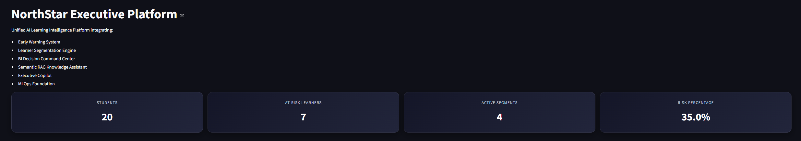
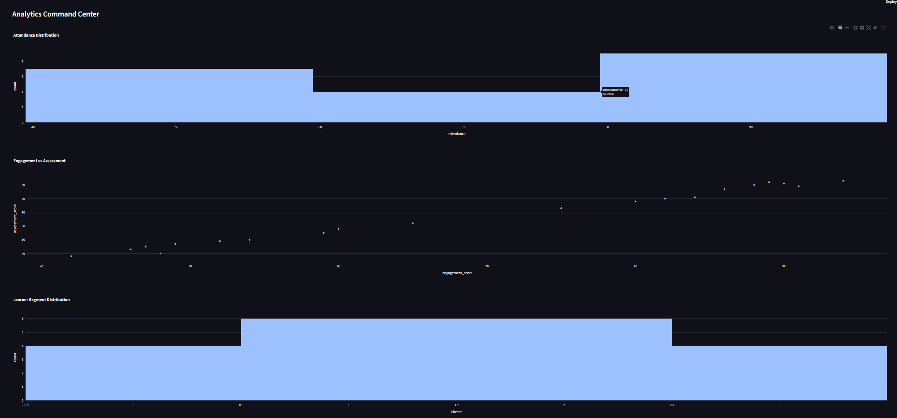

# NorthStar AI Learning Intelligence Platform

## Executive Summary

NorthStar is an end-to-end AI Learning Intelligence Platform designed to support educational institutions through predictive analytics, behavioral segmentation, business intelligence, retrieval-augmented AI, and cloud-native MLOps.

The platform integrates machine learning, analytics engineering, decision intelligence, and generative AI into a unified ecosystem that enables proactive intervention, institutional insight generation, and executive decision support.

---

## Business Problem

Educational institutions often struggle to:

- Identify at-risk learners before performance declines
- Understand behavioral patterns across learner populations
- Generate actionable insights from fragmented data sources
- Provide institutional knowledge access at scale
- Operationalize machine learning systems in production

NorthStar addresses these challenges through an integrated intelligence platform.

---

## Platform Architecture

](/GeoTheLeo/northstar-platform/blob/main/docs/screenshots/northstar_ai_platform_architecture.png)

---

## Platform Components

### Early Warning System

Predictive analytics engine that identifies learners at risk of disengagement or underperformance.

Features:

- Classification Models
- Risk Scoring
- Intervention Support
- Model Monitoring

---

### Learner Segmentation Engine

Behavioral analytics engine that discovers meaningful learner groups using unsupervised learning.

Features:

- Clustering
- Behavioral Profiling
- Engagement Analysis
- Segment Discovery

---

### BI Decision Command Center

Executive analytics dashboard providing real-time institutional visibility.

Features:

- KPI Monitoring
- Trend Analysis
- Performance Reporting
- Interactive Visualizations

---

### AI Knowledge Assistant

Retrieval-Augmented Generation (RAG) system providing contextual access to institutional knowledge.

Features:

- Semantic Search
- Sentence Embeddings
- Knowledge Retrieval
- Citation-Based Responses

---

### Executive Copilot

AI-powered decision-support assistant capable of generating executive briefings and recommendations.

Features:

- Executive Summaries
- Operational Insights
- Platform Status Reporting
- Strategic Recommendations

---

### MLOps Foundation

Cloud-native operational layer supporting deployment and monitoring of machine learning systems.

Features:

- CI/CD Pipelines
- Model Registry
- Monitoring
- Deployment Automation

---

## Technology Stack

### Data Layer

- Python
- Pandas
- NumPy
- SQL

### Machine Learning

- Scikit-Learn
- Classification Models
- K-Means Clustering

### Analytics

- Streamlit
- Plotly

### Generative AI

- Sentence Transformers
- Semantic Retrieval
- Retrieval-Augmented Generation (RAG)

### MLOps

- Docker
- GitHub Actions
- Model Monitoring

---

## System Workflow

Data Sources
→ Data Engineering
→ Early Warning
→ Segmentation
→ Business Intelligence
→ Knowledge Assistant
→ Executive Copilot
→ Decision Support

---

## Key Features

- Predictive Risk Detection
- Learner Segmentation
- Executive Dashboards
- Semantic Search
- AI-Powered Recommendations
- Executive Briefings
- MLOps Integration

---

## Screenshots

### Executive Platform



### Analytics Dashboard



### Executive Copilot


### Knowledge Assistant


---

## Repository Structure

```text
northstar-platform/

├── src/
├── data/
├── docs/
├── deployment/
├── infrastructure/
├── notebooks/
├── tests/
└── README.md
```

---

## Future Roadmap

- Azure Deployment
- Vector Database Integration
- LLM-Powered Recommendation Engine
- Real-Time Data Streaming
- Advanced MLOps Monitoring
- Multi-Tenant Architecture

---

## Author

George Smith

Data Science | Business Intelligence | Machine Learning | AI Engineering
