<p align="center">

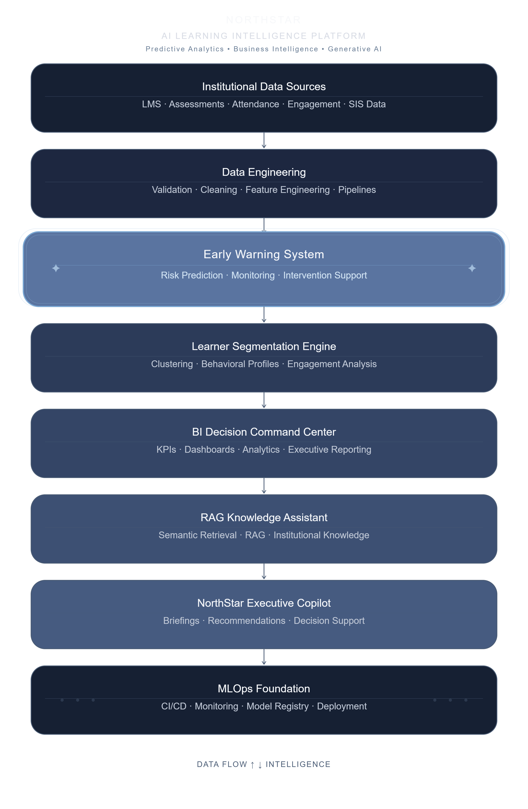

</p>

<h1 align="center">
NorthStar
</h1>

<h3 align="center">
Transforming Institutional Data into Executive Intelligence
</h3>

<p align="center">

Enterprise Applied AI Decision Intelligence Platform

</p>

<p align="center">

Predictive Analytics • Executive AI • Retrieval-Augmented Generation • Business Intelligence • MLOps

</p>

<p align="center">


</p>

---

## Executive Summary

NorthStar is an enterprise-grade **Applied AI Decision Intelligence Platform** demonstrating how predictive analytics, executive business intelligence, Retrieval-Augmented Generation (RAG), scenario simulation, and production-oriented MLOps can operate together within a unified software ecosystem.

Unlike traditional portfolio projects that showcase isolated machine learning notebooks or individual models, NorthStar presents a complete AI platform designed around real-world operational workflows. The application combines predictive analytics, executive dashboards, semantic knowledge retrieval, AI-assisted decision support, and operational monitoring into a cohesive architecture suitable for enterprise environments.

Although demonstrated using institutional learning analytics, the architectural patterns implemented throughout NorthStar generalize naturally to healthcare, finance, insurance, retail, logistics, manufacturing, customer intelligence, and any domain requiring proactive, data-driven decision making.

The repository emphasizes production-quality engineering as much as artificial intelligence, showcasing modular software architecture, maintainable code organization, reusable components, and executive-focused user experience rather than isolated machine learning experiments.

---

### Platform Highlights

- 🧠 AI-powered Executive Decision Support
- 📊 Executive Business Intelligence Dashboard
- 🎯 Predictive Risk Detection
- 👥 Behavioral Segmentation
- 💬 Retrieval-Augmented Knowledge Assistant
- 🤖 Executive AI Copilot
- 🎮 Interactive Scenario Simulator
- 📦 Production-oriented Model Registry
- 🖥 Platform Health Monitoring
- ⚙️ Modular MLOps Architecture

---

# Business Problem

Organizations frequently struggle to:

-   Detect risk before outcomes decline.
-   Convert fragmented data into executive insight.
-   Operationalize machine learning.
-   Deliver trustworthy AI-assisted decision support.
-   Monitor AI systems in production.

NorthStar demonstrates an integrated solution.

------------------------------------------------------------------------

# Design Principles

-   Business-first architecture
-   Modular, layered design
-   Explainable AI
-   Production-oriented engineering
-   Executive-focused user experience
-   Reusable analytics components

------------------------------------------------------------------------

# Platform Architecture


------------------------------------------------------------------------

# System Workflow

Data Sources → Data Engineering → Predictive Analytics → Segmentation →
Executive Analytics → AI Insights → RAG Knowledge Assistant → Executive
Copilot → Decision Support

------------------------------------------------------------------------

# Platform Modules

## 🏠 Executive Dashboard

### Executive Overview


### Operational Intelligence


------------------------------------------------------------------------

## 📊 Analytics Workspace

### Executive Analytics

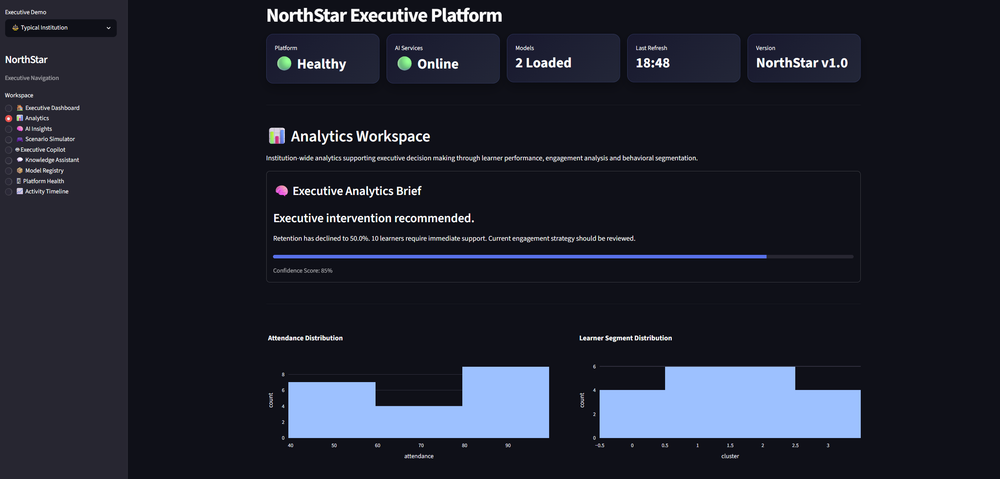

### Engagement Analysis

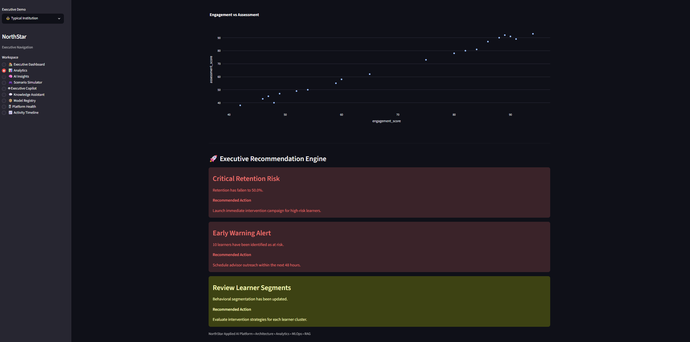

------------------------------------------------------------------------

## 🧠 AI Insights

### Executive AI Analysis

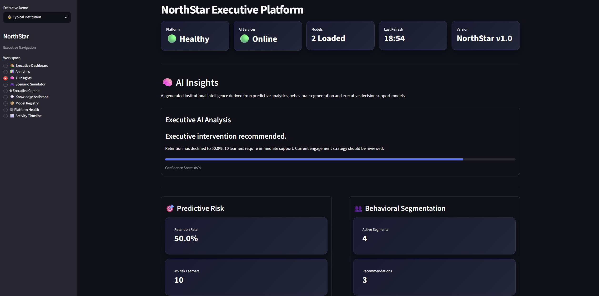

### Strategic Recommendations


------------------------------------------------------------------------

## 🤖 Executive Copilot

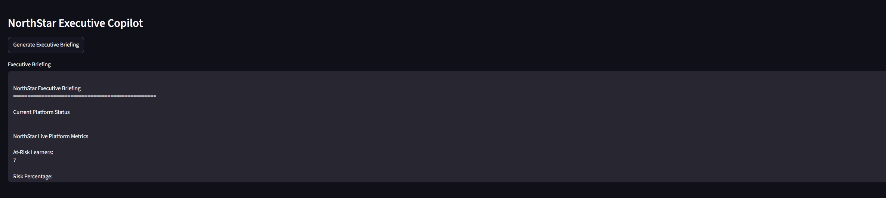

------------------------------------------------------------------------

## 💬 Knowledge Assistant

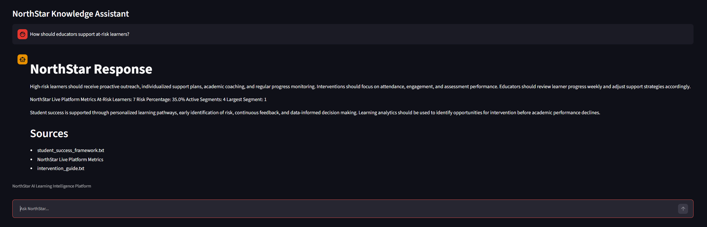

------------------------------------------------------------------------

## 🎮 Executive Scenario Simulator

### Scenario Configuration

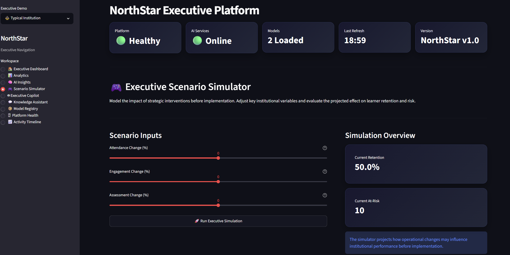

### Projected Outcomes

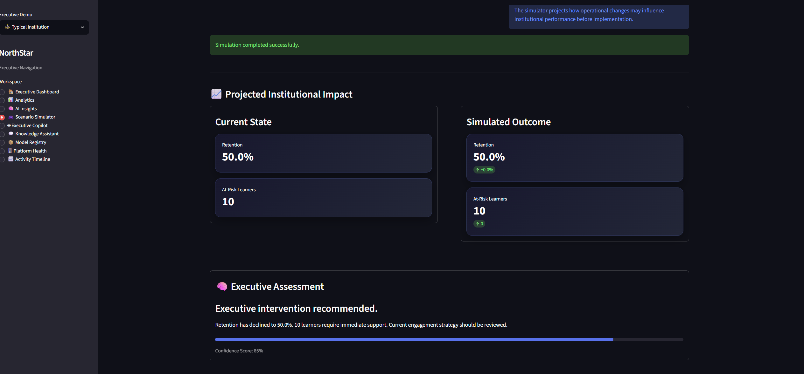

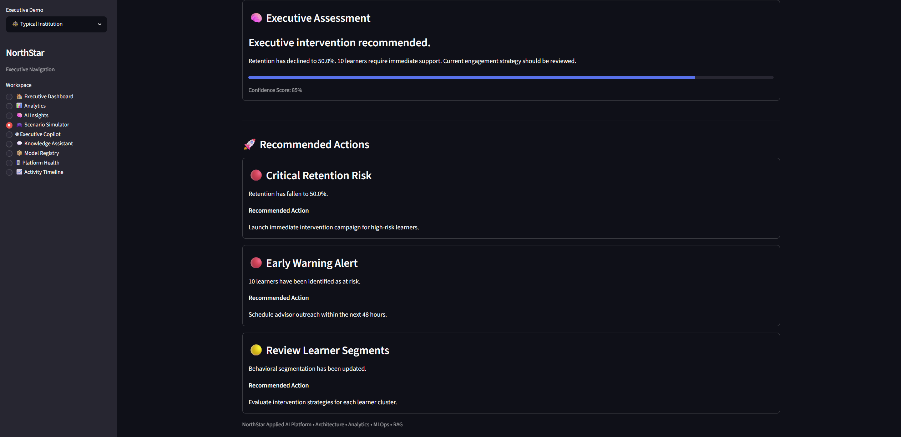

------------------------------------------------------------------------

## 🖥 Platform Health

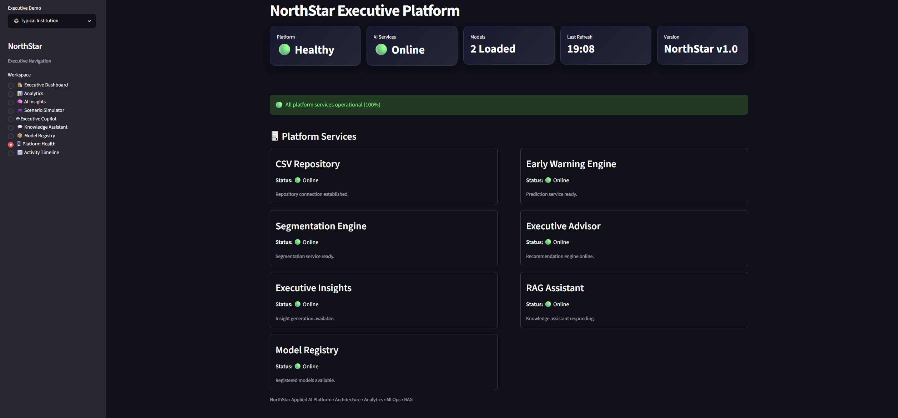

------------------------------------------------------------------------

## 📦 Model Registry

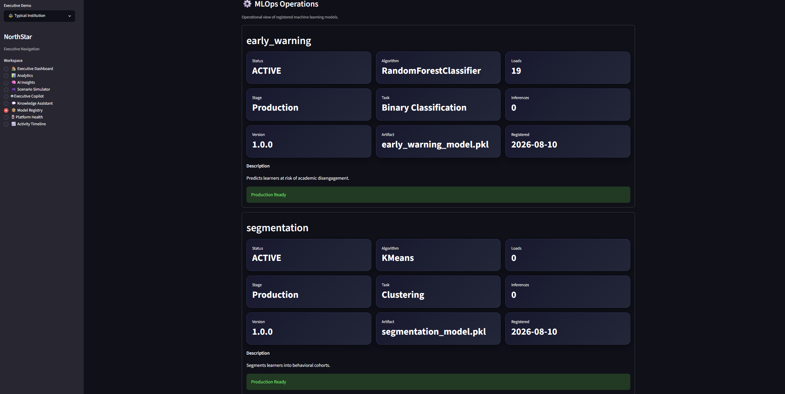

The integrated model registry manages machine learning assets,
deployment readiness, metadata, and model versioning across the
NorthStar platform.

------------------------------------------------------------------------
## 📈 Activity Timeline

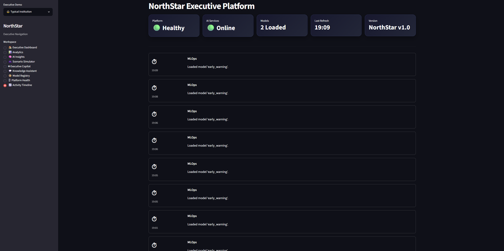

Chronological operational events provide executive visibility into
platform activity.

------------------------------------------------------------------------
# 🖥 Product Tour

The NorthStar application provides a collection of purpose-built executive workspaces, each designed around a specific decision-support responsibility.

The following sections demonstrate the platform from an executive user's perspective.

---

## 🏠 Executive Dashboard

The Executive Dashboard serves as the primary command center for institutional leadership.

It consolidates platform health, executive KPIs, AI-generated intelligence, and prioritized actions into a single decision-support workspace.

### Executive Overview

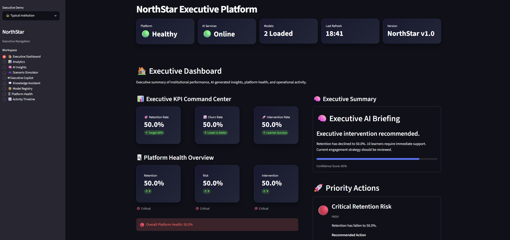

The overview provides an immediate snapshot of institutional performance and operational readiness.

Key information is surfaced through:

- **Platform Status** — immediate visibility into system readiness.
- **Executive KPIs** — retention, churn, and intervention indicators.
- **Executive AI Briefing** — concise interpretation of current institutional conditions.
- **Priority Actions** — recommendations surfaced for executive attention.

The interface is deliberately designed to minimize the distance between **data, interpretation, and action**.

### Operational Intelligence

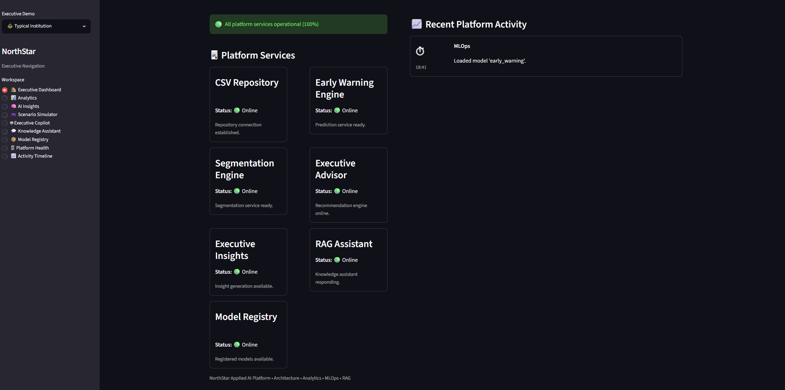

The operational view extends the executive workspace with platform health and recent activity.

This provides leadership with visibility into both **institutional performance** and the operational systems supporting that intelligence.

### Decision-Support Role

The Executive Dashboard is not intended to replace detailed analytical workflows.

Instead, it functions as the platform's **executive entry point**:

```text
Institutional Data
       ↓
Executive KPIs
       ↓
AI Interpretation
       ↓
Priority Actions
       ↓
Executive Decision

## 📊 Analytics Workspace

The Analytics Workspace provides the analytical layer behind NorthStar's executive decision-support experience.

Rather than presenting isolated visualizations, the workspace connects behavioral data, learner outcomes, segmentation, and executive recommendations to help identify the factors influencing institutional performance.

### Executive Analytics


The workspace provides an analytical view of institutional behavior and performance, allowing users to move from high-level executive indicators into the underlying evidence.

Key analytical capabilities include:

- **Attendance Analysis** — examine participation patterns across the learner population.
- **Engagement Analysis** — evaluate relationships between engagement and assessment outcomes.
- **Behavioral Segmentation** — identify distinct learner groups through clustering.
- **Executive Recommendations** — connect analytical findings to prioritized actions.

### Engagement & Outcome Analysis


The engagement analysis provides a deeper view of the relationship between learner engagement and assessment performance.

This helps move the platform from descriptive reporting toward **diagnostic intelligence**: identifying patterns that may explain why outcomes differ across populations.

### Analytical Decision Flow

```text
Behavioral Data
       ↓
Exploratory Analysis
       ↓
Pattern Detection
       ↓
Segmentation
       ↓
Performance Interpretation
       ↓
Executive Recommendation

# Technology Stack

## Data

-   Python
-   Pandas
-   NumPy
-   DuckDB
-   SQL

## Machine Learning

-   Scikit-learn
-   Classification
-   Clustering

## AI

-   Sentence Transformers
-   Retrieval-Augmented Generation (RAG)

## Visualization

-   Streamlit
-   Plotly

## MLOps

-   Docker
-   GitHub Actions

------------------------------------------------------------------------

# Repository Structure

``` text
northstar-platform/
├── assets/
├── data/
├── docs/
│   ├── adr/
│   └── screenshots/
├── models/
├── notebooks/
├── sql/
├── src/
└── README.md
```

------------------------------------------------------------------------

# Getting Started

``` bash
git clone https://github.com/GeoTheLeo/northstar-platform.git
cd northstar-platform
python -m venv .venv
pip install -r requirements.txt
streamlit run src/northstar/app.py
```

------------------------------------------------------------------------

# Architecture Decision Records

Architecture decisions are documented in `docs/adr/`.

------------------------------------------------------------------------

# Future Roadmap

-   Azure deployment
-   Vector database integration
-   Explainable AI
-   Real-time streaming
-   Executive exports
-   Multi-tenant architecture

------------------------------------------------------------------------

# Author

**George Smith**

Applied AI • Data Science • Machine Learning • Business Intelligence •
MLOps

------------------------------------------------------------------------

If this project interests you, feel free to connect and discuss Applied
AI, Decision Intelligence, MLOps, and enterprise analytics.
